# Project Diagrams: Ledger (AI-Based Fake News Detection System)

**Project Group 12** | College of Engineering, Cherthala  
**Base Paper:** *Advancing Fake News Detection: Hybrid Deep Learning With FastText and Explainable AI* (IEEE Access, 2024)

---

### Note on ER Diagram
* **Why an ER Diagram is NOT applicable:** Ledger is a stateless AI inference tool, not an OLTP database application. Users submit text, the model verifies it in-memory, and returns the result with LIME explanations. There are no relational tables (such as users, orders, carts, or transactions) to model.

---

## 1. High-Level System Architecture

A clean overview of the 3-tier system: React frontend, FastAPI backend, and the core AI engine.

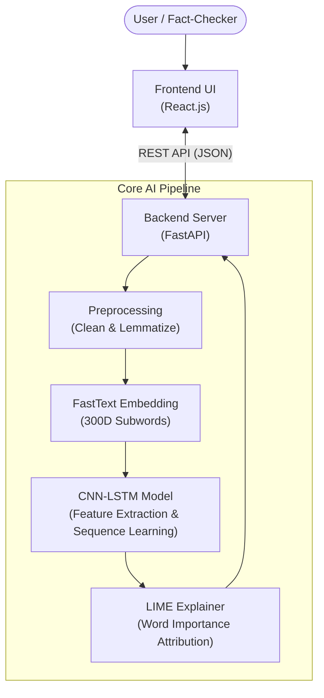

---

## 2. End-to-End System Pipeline Flowchart

Linear flow showing how input text travels from raw submission to the final highlighted report.

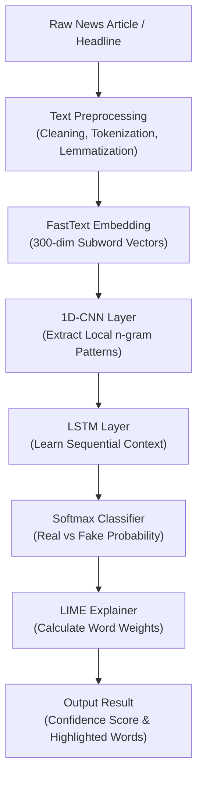

---

## 3. Deep Learning Model Architecture (CNN-LSTM)

Layer-by-layer structure of the hybrid neural network as described in the base paper.

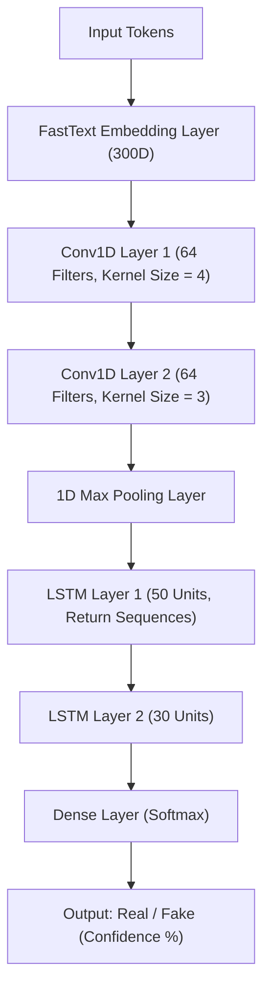

---

## 4. Explainable AI (LIME) Workflow

Simple step-by-step mechanism of how LIME explains individual predictions.

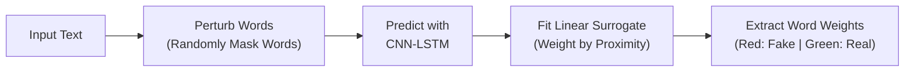

---

## 5. Data Flow Diagram (DFD) - Level 0 (Context Diagram)

High-level boundary between external actors and the Ledger system.

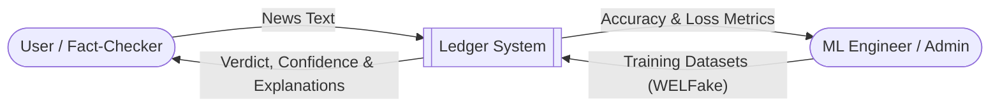

---

## 6. Data Flow Diagram (DFD) - Level 1

Functional breakdown of data movement across preprocessing, embedding, model inference, and explainability.

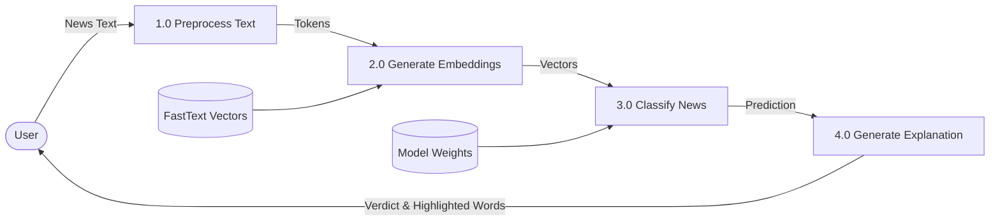

---

## 7. UML Use Case Diagram

Primary use cases for the regular user and administrator.

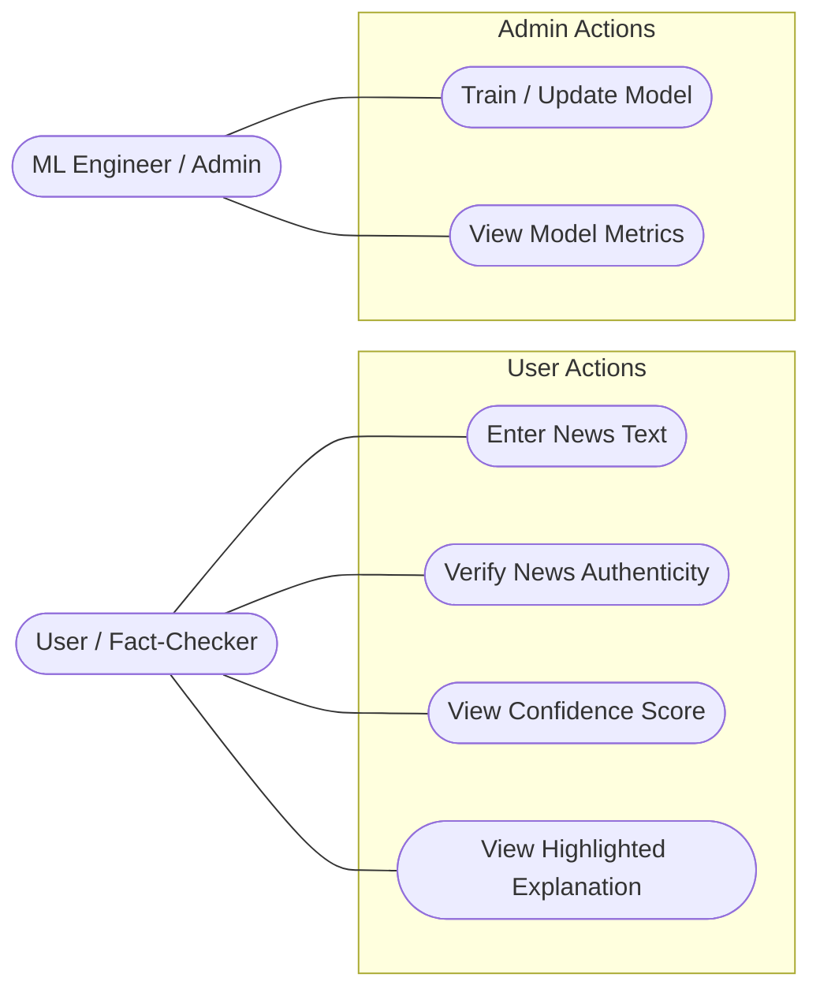

---

## 8. UML Sequence Diagram

Chronological request-response lifecycle from user interaction to backend inference and result display.

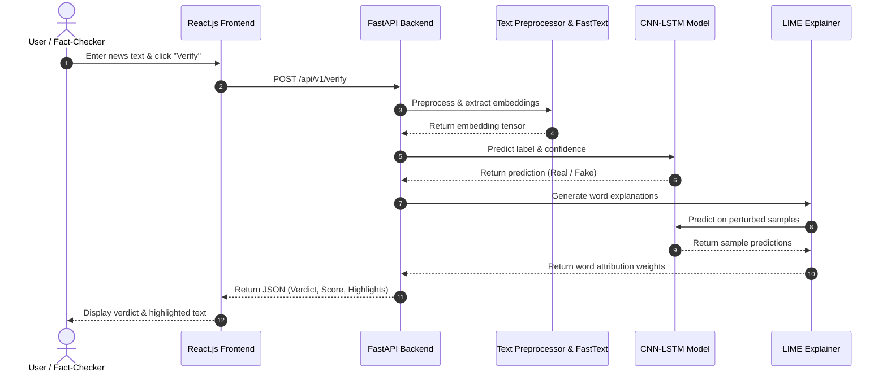

---

## 9. UML Activity Diagram

Control flow showing input validation, model execution, and decision paths.

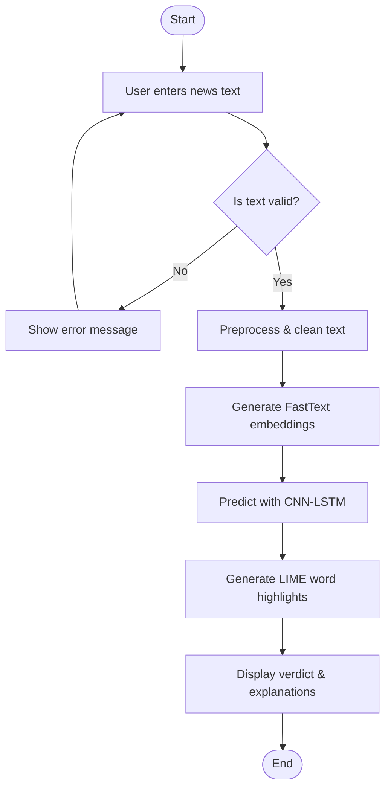

---

## 10. UML Component Diagram

Modular software components and their dependencies.

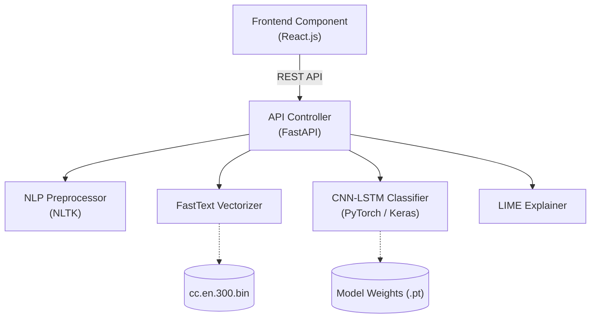

---

## 11. UML Deployment Diagram

Hardware and runtime mapping across client and server environments.

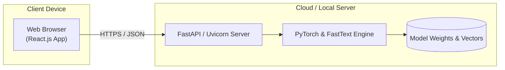

---

## 12. State Machine Diagram

Lifecycle states of an article verification request.

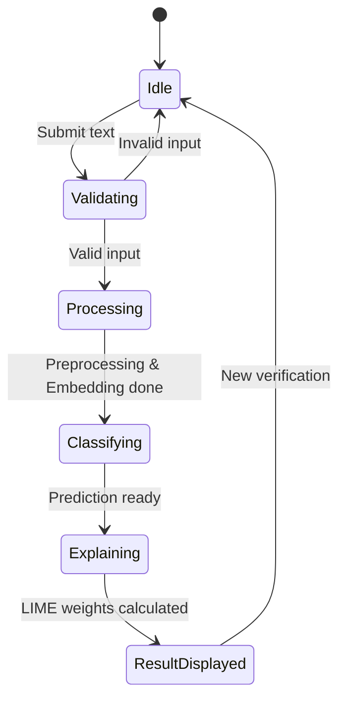
